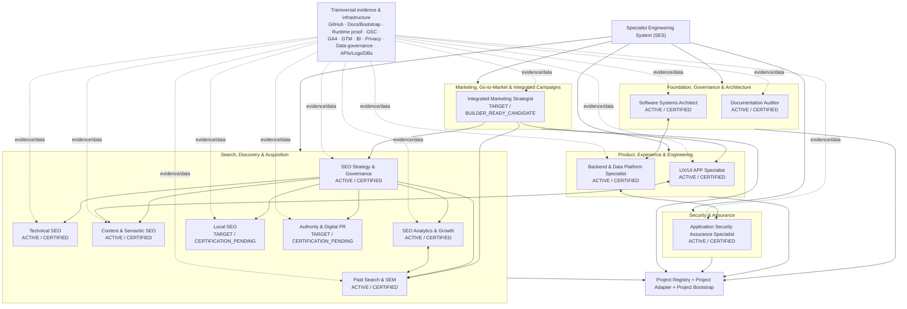

# SES — Canonical Specialist Framework v0.2

**Status:** `CANONICAL_V0_2 / PORTFOLIO_ARCHITECTURE_AUTHORITY`  
**Scope:** canonical specialist domains, names, archetype identifiers, lifecycle, transversal capabilities, project-adoption semantics and legacy-identity boundaries.

## 1. Purpose

This document is the canonical SES framework for understanding the specialist ecosystem as one coherent system.

It prevents drift between:
- current canonical specialist identities;
- legacy project-local GPT labels;
- certified specialists;
- target/planned specialists;
- transversal capabilities;
- project adoption;
- project-local context and authority.

It does not replace `archetypes/REGISTRY.md`, the certification ledger, Project Adapters or consumer-project sources. It defines how those pieces fit together.

## 2. Canonical invariants

```text
SPECIALIST_AVAILABLE != SPECIALIST_ADOPTED_BY_PROJECT
CERTIFIED_FOR_ANY_PROJECT != CONSUMER_PROJECT_ADOPTED
ADOPTED != PROJECT_CONTEXT_READY
PROJECT_CONTEXT_READY != AUTHORIZED_TO_MUTATE
TOOL_CAPABILITY != AUTHORIZATION
CURRENT_STATE != TARGET_STATE
LEGACY_ALIAS != CANONICAL_IDENTITY
```

## 3. Canonical portfolio model

### 3.1 Foundation, Governance & Architecture

| Canonical specialist | ARCHETYPE_ID | Current state | Scope summary |
|---|---|---|---|
| SES — Documentation Auditor | `documentation-auditor` | ACTIVE / CERTIFIED | evidence, provenance, claim decomposition, coverage, contradictions, freshness, reproducible verdicts |
| SES — Software Systems Architect | `software-systems-architect` | ACTIVE / CERTIFIED | AS-IS/TARGET architecture, boundaries, trade-offs, dependencies, reliability, integrations, migration and proof obligations |

Legacy continuity aliases for Software Systems Architect may include `SaaS Architect`, `SES SaaS Architect` and `saas-architect`. They are not the current canonical identity.

### 3.2 Product, Experience & Engineering

| Canonical specialist | ARCHETYPE_ID | Current state | Scope summary |
|---|---|---|---|
| SES — UX/UI APP Specialist | `ux-ui-app-specialist` | ACTIVE / CERTIFIED | journeys, flows, IA, accessibility, mobile, usability, design-system and experience evidence |
| SES — Backend & Data Platform Specialist | `backend-data-platform-specialist` | ACTIVE / CERTIFIED | APIs, services, data, databases, authorization, tenant isolation, transactions, platform integrity and observability |

### 3.3 Security & Assurance

| Canonical specialist | ARCHETYPE_ID | Current state | Scope summary |
|---|---|---|---|
| SES — Application Security Assurance Specialist | `application-security-assurance-specialist` | ACTIVE / CERTIFIED | threat modeling, auth/session/secrets, vulnerabilities, hardening, assurance, active-test boundaries and security proof |

### 3.4 Search, Discovery & Acquisition

| # | Canonical specialist | ARCHETYPE_ID | Current state | Coverage |
|---|---|---|---|---|
| 1 | SES — SEO Strategy & Governance Specialist | `seo-strategy-governance-specialist` | ACTIVE / CERTIFIED | opportunity diagnosis, search strategy, prioritization, roadmap, macro keyword strategy, market/competition, KPIs, trade-offs and specialist coordination |
| 2 | SES — Technical SEO Specialist | `technical-seo-specialist` | ACTIVE / CERTIFIED | crawling, indexation, robots, sitemaps, canonicals, rendering/JS SEO, Core Web Vitals, redirects, hreflang, structured data, logs and retrievability |
| 3 | SES — Content & Semantic SEO Specialist | `content-semantic-seo-specialist` | ACTIVE / CERTIFIED | search intent, entities, topical coverage, on-page SEO, internal linking, answerability, citability, GEO capability, factuality and E-E-A-T |
| 4 | SES — SEO Analytics & Growth Specialist | `seo-analytics-growth-specialist` | ACTIVE / CERTIFIED | GSC/GA4 measurement, conversions, dashboards, KPIs, attribution, incrementalidade, experiments and growth analysis |
| 5 | SES — Local SEO Specialist | `PROPOSED: local-seo-specialist / NOT_YET_REGISTERED` | TARGET / CERTIFICATION_PENDING | Google Business Profile, NAP, reviews, reputation, local citations, local landing pages, local schema, Apple Maps, Bing Places and local discovery |
| 6 | SES — Authority & Digital PR Specialist | `PROPOSED: authority-digital-pr-specialist / NOT_YET_REGISTERED` | TARGET / CERTIFICATION_PENDING | backlink strategy, link earning/acquisition, Digital PR, brand mentions, outreach, publisher relationships, authority signals, toxic-link risk and off-page reputation |
| 7 | SES — Paid Search & SEM Specialist | `paid-search-sem-specialist` | ACTIVE / CERTIFIED | Google Ads Search, Microsoft Ads, campaign/ad-group structure, keywords, match types, negatives, search terms, bidding, budget, Quality Score, landing alignment, CPL/CPA/ROAS and SEO/SEM overlap |

The two TARGET rows are architecture targets only. Their proposed identifiers are not registry entries and become canonical `ARCHETYPE_ID` values only after explicit archetype design/registration. Their presence here must not be interpreted as current certification, active archetype resolution or project adoption.

GEO is a cross-cutting capability primarily spanning Strategy, Content/Semantic, Technical and Analytics. It is not currently a separate canonical specialist.

### 3.5 Marketing, Go-to-Market & Integrated Campaigns

| Canonical specialist | ARCHETYPE_ID | Current state | Scope summary |
|---|---|---|---|
| SES — Integrated Marketing Strategist | `PROPOSED: integrated-marketing-strategist / NOT_YET_REGISTERED` | TARGET / BUILDER_READY_CANDIDATE | market/customer diagnosis, segmentation, positioning, value proposition, offer strategy, GTM, integrated digital + conventional campaigns, channel mix, media-allocation scenarios, journey/funnel, KPI governance and Marketing → Sales alignment |

This TARGET specialist is a Builder-ready candidate only. Its candidate archetype contract may exist outside the active registry while L1/L2/runtime certification remains pending.

`TARGET != ACTIVE != CERTIFIED_FOR_ANY_PROJECT != CONSUMER_PROJECT_ADOPTED`

Its role is integrative rather than monolithic: it coordinates Search, UX, Analytics, CRM/Data, Security/Privacy/Legal and Sales handoffs without appropriating those specialist or project-local authorities.

## 4. Transversal capabilities and evidence layers

The specialists share evidence and infrastructure layers without collapsing their authority boundaries:

- GitHub / repositories: code, PRs, history, releases, configuration and technical evidence;
- documentation / bootstrap / handoffs: context, durable decisions, rules, continuity and authority locators;
- runtime proof / Actions: actual invocation evidence and tool-honesty proof;
- Google Search Console: query, coverage, indexing, visibility and search-performance evidence;
- GA4: events, sessions, conversions, funnels and analytics evidence;
- Google Tag Manager: instrumentation, tags, triggers and variables;
- Looker Studio / BI: dashboards, KPI views and reporting;
- Consent & Privacy: LGPD/GDPR, consent, data minimization and privacy boundaries;
- Data Integrity / Governance: quality, lineage, metric definitions, validation and provenance;
- APIs / logs / databases: operational and implementation evidence.

These are capabilities/sources. They are not automatic authorities.

## 5. Specialist lifecycle

```text
INTENT
→ INTERVIEW
→ REQUIREMENTS
→ ASSUMPTIONS
→ CHALLENGE
→ ALTERNATIVES
→ DESIGN
→ CANDIDATE
→ BUILDER KERNEL / PACKAGE
→ L1 FUNCTIONAL VALIDATION
→ L2 RUNTIME PROOF
→ READINESS
→ ARCHETYPE ACTIVE
→ CERTIFIED_FOR_ANY_PROJECT
→ EXPLICIT PROJECT ADOPTION
```

Preserve:

```text
GENERATE != AUTHORIZE != PUBLISH
READY != CERTIFIED_FOR_ANY_PROJECT
ARCHETYPE_ACTIVE != CERTIFIED_FOR_ANY_PROJECT
CERTIFIED_FOR_ANY_PROJECT != CONSUMER_PROJECT_ADOPTED
```

## 6. Project Adapter model

A reusable specialist becomes project-usable only through explicit project resolution and, where required, adoption.

```text
EXPLICIT PROJECT
+ ROLE
→ projects/REGISTRY.md
→ PROJECT_ADAPTER
→ exact ROLE -> ARCHETYPE_ID mapping
→ archetypes/REGISTRY.md
→ current certification ledger
→ consumer-project live bootstrap
→ project-local rules / continuity / authority
→ Context Readiness
→ bounded specialist work
```

The Project Adapter maps stable identity and locators. Consumer projects remain authoritative for their product truth, repositories, environments, data, runtime state, business definitions and mutation authority.

## 7. Cross-specialist handoffs

Examples of intended separation:

- Documentation Auditor audits evidence produced by any domain without appropriating that domain's authority.
- Software Systems Architect defines system boundaries and target architecture; Backend/Data owns backend/data engineering method; AppSec independently assures security.
- SEO Strategy coordinates the Search portfolio without replacing Technical SEO, Content/Semantic, Analytics, Local, Authority/Digital PR or Paid Search.
- Paid Search may hand landing-page issues to UX/UI or Content; Analytics may hand tracking defects to GTM/Backend/Privacy; Technical SEO may hand rendering/platform defects to Architecture/Backend.
- Integrated Marketing Strategist owns cross-channel marketing strategy and may coordinate Search, UX, Analytics, CRM/Data, Privacy/Legal and Sales handoffs; channel coordination does not transfer specialist execution authority, spend authority, pricing authority or publication authority.
- AppSec may return implementation findings to Backend/Data and architecture findings to Software Systems Architect.

`HANDOFF != AUTHORITY_TRANSFER`.

## 8. Value flow

```text
DEMAND / PROBLEM
→ DIAGNOSIS
→ STRATEGY
→ SPECIALIZED EXECUTION
→ VALIDATION / EVIDENCE
→ DISCOVERY / VISIBILITY
→ QUALIFIED TRAFFIC
→ CONVERSION / RESULT
→ GROWTH / LEARNING
→ MEASUREMENT / FEEDBACK
```

## 9. Canonical Mermaid view



## 10. Legacy-identity policy

Legacy labels such as `GPT0`, `GPT1`, `GPT8`, `SaaS Architect` or project-specific Builder names may remain in historical/project-local sources where required for continuity.

They must never silently override current canonical identity.

For material SES routing and framework communication:

```text
CANONICAL_NAME + ARCHETYPE_ID = PRIMARY IDENTITY
LEGACY LABEL = CONTINUITY POINTER ONLY
```

Migration is governed by `docs/migrations/LEGACY_SPECIALIST_IDENTITY_MIGRATION_PLAN.md`.

## 11. Authority and evolution

This framework is an architecture authority for SES portfolio nomenclature and relationships. It does not auto-certify, auto-adopt, auto-upgrade or mutate projects.

Future specialist additions, renames, splits or merges require explicit versioned SES decisions, affected-gate analysis and deliberate consumer-project adoption where applicable.
