# SES — Documentation Auditor Runtime Enforcement Gateway — Design v1

**Status:** `DESIGN_V1 / REVIEW_CANDIDATE / NOT_IMPLEMENTED / SPECIALIST_SPECIFIC`
**Specialist:** `SES — Documentation Auditor`
**Decision authority:** product/design decisions explicitly approved in design interview
**Parent ADR:** `docs/architecture/ADR-001-DOCUMENTATION_AUDITOR_RUNTIME_ENFORCEMENT_GATEWAY.md`
**Historical runtime boundary:** Documentation Auditor v0.9 corrected Gate 0 = `4/7`; R03A/R05/R06 remain FAIL

## 1. Purpose

Define a proof-first runtime control boundary outside ordinary model instruction-following so that critical Documentation Auditor transitions and user-visible release do not depend only on the model voluntarily following a prompt.

The Gateway is a controller between the user and the specialist. The model may propose classifications, readiness and substantive claims; the controller owns state transitions, trusted evidence attestation and user-visible release.

```text
MODEL MAY PROPOSE
CONTROLLER MUST VERIFY
CONTROLLER ALONE MAY TRANSITION
CONTROLLER ALONE MAY RELEASE
```

This document is design only. It does not implement, deploy or certify the Gateway.

## 2. Why it exists

The v0.9 Gate 0 established three runtime failure dimensions on the same fingerprinted specialist boundary:

- R03A: project-specific substantive output before readiness;
- R05: unsolicited registered-project enumeration after correct `PROJECT_NOT_REGISTERED`;
- R06: early multi-project comparison plus invalid/incomplete readiness artifact.

A wording-only v0.10 is blocked by prompt-level stop loss. The design therefore moves critical rules from model instructions into an external controller/state-machine boundary.

## 3. Placement

The Gateway belongs on the SES runtime side, outside the Custom GPT and outside consumer projects.

```text
USER
  ↓
SES Gateway UI/API
  ↓
Runtime Enforcement Gateway
  ├─ controller / state machine
  ├─ resolvers + trusted evidence
  ├─ readiness validation
  ├─ scope validation
  ├─ model generator/evaluator workers
  ├─ release gate
  └─ trace/persistence
  ↓
USER-VISIBLE RESPONSE
```

FECH.AI, Blogs/SEO and other consumer projects remain project-owned evidence/authority sources; the Gateway does not become their source of truth.

## 4. Approved design decisions D01–D22

### Core authority and contracts

- **D01** — Gateway is an external controller; the current Custom GPT may coexist but cannot be the enforcement host.
- **D02** — Model-controller contract uses structured candidate artifacts instead of unrestricted direct user-visible prose.
- **D03** — Model may propose evidence requests/identifiers; only controller-side resolvers may create trusted evidence handles.
- **D04** — Structured `ReadinessEnvelope` is canonical; textual Context Readiness Receipt is a rendered derivative.
- **D05** — Multi-project work uses one independently validated readiness boundary per project plus controller-derived comparison scope.
- **D06** — Fail-closed responses are controller-owned; natural language may only render controller-released fields.
- **D07** — v1 is proof-first architecture, not a premature production platform; no framework/cloud topology is selected by design alone.

### Readiness/output decisions

- **D08** — `ReadinessEnvelope` is a typed union: `SES_SELF_READINESS | PROJECT_READINESS | COMPARISON_READINESS`.
- **D09** — One invalid substantive claim rejects the whole candidate bundle; no silent sentence filtering.
- **D10** — In multi-project work, safe project-local results may survive a blocked comparison only as explicit `LIMITED` scope when semantically valid.
- **D11** — Generator and semantic scope evaluator are separate invocations/roles; a generator cannot self-approve its own claims.

### Scope/trace/release integrity

- **D12** — `TASK_SCOPE` is represented by an immutable `TaskScopeGraph` containing addressable `ScopeUnit`s; `EFFECTIVE_SCOPE` selects/subsets those units and cannot silently invent new substantive scope.
- **D13** — Deterministic structural/policy failures have precedence over semantic evaluation; semantic evaluation cannot waive deterministic failure.
- **D14** — Gateway trace is append-only; rejected transitions, failures and corrective adjudications remain historical events.
- **D15** — v1 renderer is non-generative/tightly deterministic; future generative rendering requires a new validation boundary.
- **D16** — Material artifacts are digest-bound across validation, authorization and rendering.

### Implementation-substrate boundaries

- **D17** — Enforcement authority lives in an external SES-controlled controller, not inside the Custom GPT.
- **D18** — v1 uses a low-level model API interface controlled by the controller; the model runtime does not own the workflow/state machine. Responses API is the current preferred implementation candidate, not yet an adopted dependency.
- **D19** — Structured model schemas are preferred where applicable, but schema validity never establishes evidence trust or state validity.
- **D20** — Agent frameworks may be subordinate libraries but are not Gateway transition/release authority in v1.
- **D21** — Canonical Gateway execution state and append-only proof trace are SES-controller-owned and persist outside provider/model session state; provider tracing is supplementary only.
- **D22** — Deployment topology remains undecided; local service/container/serverless/etc. are future implementation choices provided D01–D21 remain invariant.

## 5. Trust model

```text
T0 RAW_INPUT
T1 MODEL_PROPOSED
T2 RESOLVER_ATTESTED
T3 CONTROLLER_VALIDATED
T4 RELEASE_AUTHORIZED
```

Forbidden shortcuts include `T1 → T3` without validation/evidence and `T1 → T4` directly.

```text
MODEL_ASSERTED_READY != EVIDENCE_ATTESTED_READY
SCHEMA_VALID != EVIDENCE_SUPPORTED
READINESS_VALID != OUTPUT_RELEASE_AUTHORIZED
```

## 6. End-to-end state flow

```mermaid
flowchart LR
  U[User task] --> G[Gateway Controller]
  G --> T[Target classification / entry validation]
  T -->|missing or ambiguous| C[Clarification only / STOP]
  T -->|explicit informational list| L[Informational registry output\nNo numeric binding]
  T -->|explicit SES target| S[SES self flow]
  T -->|explicit consumer project| P[Project resolution]
  P --> E[Trusted evidence acquisition + provenance]
  S --> E
  E --> R[ReadinessEnvelope candidate]
  R --> V[Schema + deterministic policy + evidence attestation]
  V -->|READY| RS[READY scope validated]
  V -->|LIMITED| LS[LIMITED strict-subset scope + GAPS]
  V -->|BLOCKED| B[No substantive analysis]
  RS --> M[Model Generator]
  LS --> M
  M --> CB[SubstantiveClaimBundle]
  CB --> SE[Independent Semantic Evaluator]
  SE --> O[Output/evidence/project/digest validation]
  O -->|accept| RG[Deterministic Renderer]
  O -->|reject| X[Candidate rejected / trace preserved]
  RG --> UO[User-visible response]
```



No direct `Model → User` substantive path exists in the target architecture.

## 7. Target-entry rules

Before consumer-project materialization, classify target using Core semantics.

- missing consumer-project identifier → clarification only → STOP;
- SES-vs-consumer ambiguity → clarification only → STOP;
- explicit informational list or registry-metadata/list-membership-only request → enumeration may be released;
- informational enumeration creates no persistent number-to-project binding;
- later bare list position is not a project identifier unless that number is itself a canonical ID/alias;
- explicit supplied identifier continues to exact canonical Registry resolution even when misspelled/unregistered;
- zero match → `PROJECT_NOT_REGISTERED` → STOP without unsolicited alternative project enumeration.

## 8. Project resolution and evidence

Project materialization follows the canonical SES Registry → Adapter → consumer canonical source → project-local bootstrap/specialist/continuity/authority chain.

`TrustedEvidenceHandle` is created only by controller-side resolution and contains, conceptually:

```text
evidence_id
evidence_class
authority_status
source_locator
resolved_ref
project_id / target / environment bindings when applicable
retrieval status / coverage / freshness
provenance
invalidation keys
```

A model may emit an `EvidenceRequest`; it may not mint a trusted handle.

## 9. Readiness model

### 9.1 Typed union

```text
ReadinessEnvelope =
  SES_SELF_READINESS
  | PROJECT_READINESS
  | COMPARISON_READINESS
```

SES self-work must not pretend SES is a consumer project.

### 9.2 Project readiness

`PROJECT_READINESS` preserves the full canonical hybrid receipt semantics, including:

```text
PROOF_LEVEL
TASK_SCOPE
EFFECTIVE_SCOPE
TARGET_REF_OR_OBJECT
ENVIRONMENT
SES_CANONICAL_MAIN_REF
SES_CANDIDATE_REF
SES_EFFECTIVE_REF
SES_ARCHETYPE_RESOLUTION_STATUS
SES_ARCHETYPE_ID
SES_ARCHETYPE_SOURCE_REF
PROJECT_RESOLUTION_STATUS
PROJECT_ID
PROJECT_ADAPTER_STATUS
PROJECT_ADAPTER_REF
CANONICAL_PROJECT_SOURCE
PROJECT_LIVE_REF
PROJECT_BOOTSTRAP_STATUS
PROJECT_BOOTSTRAP_REF
SPECIALIST_RESOLUTION_STATUS
SPECIALIST_SOURCE_REF
PROJECT_CONTINUITY_STATUS
PROJECT_CONTINUITY_REF
MATERIAL_EVIDENCE_STATUS
AUTHORITY_MODEL_STATUS
MUTATION_AUTHORIZATION_STATUS
CONTEXT_STATUS
RECEIPT_VALIDITY
GAPS
```

Material fields require evidence bindings; a syntactically valid artifact with invented/stale/unsupported refs is rejected.

### 9.3 Proof-ref relationships

Ordinary canonical/runtime work:

```text
SES_CANDIDATE_REF = NOT_APPLICABLE
SES_EFFECTIVE_REF = SES_CANONICAL_MAIN_REF
```

Candidate-head proof:

```text
SES_CANONICAL_MAIN_REF = live canonical main
SES_CANDIDATE_REF = exact candidate head
SES_EFFECTIVE_REF = SES_CANDIDATE_REF
```

Distinct field roles do not imply pairwise-distinct values.

## 10. READY / LIMITED / BLOCKED

`READY` requires full safe task scope, applicable authoritative evidence and no unresolved material contradiction.

`LIMITED` requires an explicit safe strict subset of requested scope plus `GAPS`; excluded portions cannot be answered silently.

`BLOCKED` means no safe substantive scope was established. User instruction to "continue anyway" does not open substantive analysis.

## 11. Scope representation

`TaskScopeGraph` decomposes the user's material objective into immutable addressable `ScopeUnit`s. Documentation Auditor v1 operation classes may include `AUDIT`, `VERIFY_CLAIM`, `COMPARE`, `REVALIDATE`, `MAP_EVIDENCE`, `ASSESS_COVERAGE`, `ASSESS_CONTRADICTION`, `ASSESS_FRESHNESS`, `SYNTHESIZE`.

`EffectiveScope` selects existing ScopeUnit IDs:

```text
EFFECTIVE_SCOPE.units ⊆ TASK_SCOPE.units
```

A new substantive unit requires explicit task change/reclassification, not scope laundering.

## 12. Multi-project comparison

Every project receives independent resolution, evidence and readiness. `ComparisonReadiness` is derived from those project boundaries and cannot create them.

Comparative claims require a semantic common scope supported by every project material to that claim. If one required project is BLOCKED, affected comparative units are BLOCKED. Independent safe project-local units may remain available only through explicit LIMITED degradation.

## 13. Analysis/output contract

After status-aware scope validation, the Generator emits a `SubstantiveClaimBundle`; it never has release authority.

Each claim binds to project(s), allowed ScopeUnit(s), comparison scope where applicable and evidence handle(s). An independent semantic evaluator classifies claim-to-scope compatibility. Deterministic failure cannot be waived by semantic approval.

One substantive claim that is `OUT_OF_SCOPE` or materially `UNDETERMINED` rejects the entire candidate bundle. A later regenerated candidate is a new attempt; the rejected one remains historical.

## 14. Release integrity

The renderer is deterministic/tightly constrained and may only render controller-authorized structured content. Material artifacts are digest-bound so that:

```text
VALIDATED_ARTIFACT_DIGEST
= AUTHORIZED_ARTIFACT_DIGEST
= RENDERED_SOURCE_ARTIFACT_DIGEST
```

A mismatch fails closed.

## 15. Invalidation/revalidation

Material changes to task/effective scope, project, target, environment, SES/project refs, specialist/continuity/authority/mutation state or contradictory/superseding evidence invalidate only affected dependencies and require proportional revalidation.

There is no session-wide permanent READY state.

## 16. Observability

`GatewayTrace` is append-only and must reconstruct at least:

- target classification and informational-list exception;
- supplied identifiers and resolver outcomes;
- enumeration/numeric-binding attempts and decisions;
- proof level and SES ref relationships;
- task/effective/comparison scope and gaps;
- trusted evidence handles/provenance;
- readiness fields proposed/verified/rejected;
- transition attempts accepted/rejected;
- invalidation/revalidation events;
- generated/accepted/rejected/released artifact IDs/digests;
- model generator invocation and independent evaluator invocation;
- mutation authorization state;
- exact Gateway/policy/validator runtime versions.

Secrets/credentials are never logged.

## 17. Threat model

Primary design threats:

1. transition bypass;
2. trust/evidence forgery;
3. scope laundering;
4. cross-project contamination;
5. release bypass;
6. trace/proof mismatch.

The design addresses these as proof obligations; no implementation proof exists yet.

## 18. Implementation substrate conclusion

Rejected as primary enforcement hosts:

- Custom GPT instructions alone;
- Custom GPT + validator Action while unrestricted direct output remains possible;
- a proxy architecture that cannot own the complete user-visible release path.

Preferred v1 logical substrate:

```text
External SES-controlled controller
+ explicit SES state machine
+ low-level model API calls
+ controller-side resolvers/trusted evidence
+ deterministic validators/release gate
+ durable SES-owned execution state/trace
+ deterministic renderer
```

Agent frameworks may be subordinate libraries. Workflow engines and deployment topology remain future implementation trade-offs, not current decisions.

## 19. Coexistence and rollback

The private Documentation Auditor v0.9 Custom GPT remains the instruction-driven historical/current baseline during design/testing. A future Gateway candidate is a new runtime proof boundary and may not silently replace or mutate the Builder. Rollback must disable the Gateway candidate without consumer-project canonical-state mutation.

## 20. Historical integrity and non-goals

This design does not:

- retroactively pass R03A/R05/R06 or v0.9 smoke;
- establish `PROJECT_TARGET_REGRESSION_PASS`;
- establish full Documentation Auditor runtime certification;
- authorize the authority-challenge overlay;
- mutate the Builder;
- mutate FECH.AI, Blogs/SEO or another consumer project;
- implement/deploy the Gateway;
- establish mechanical enforcement;
- universalize Gateway requirements across SES specialists.

Gateway learning remains `SPECIALIST_SPECIFIC / CANDIDATE_LEARNING` until independent cross-domain evidence supports generalization.

## 21. Review gate

Design v1 is reviewable when:

- D01–D22 are preserved;
- state/readiness/scope/evidence/release boundaries are internally coherent;
- proof matrix maps every material invariant to at least one adversarial challenge;
- trace requirements can demonstrate attempted prohibited transitions, not merely final-response absence;
- implementation remains separately authorized.

Implementation authorization, if ever granted, must be a new explicit decision after this design checkpoint is reviewed/merged.
